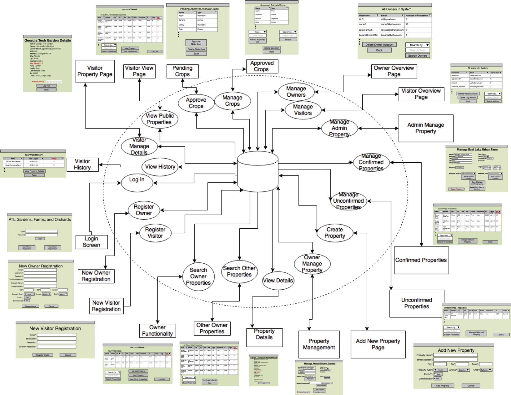
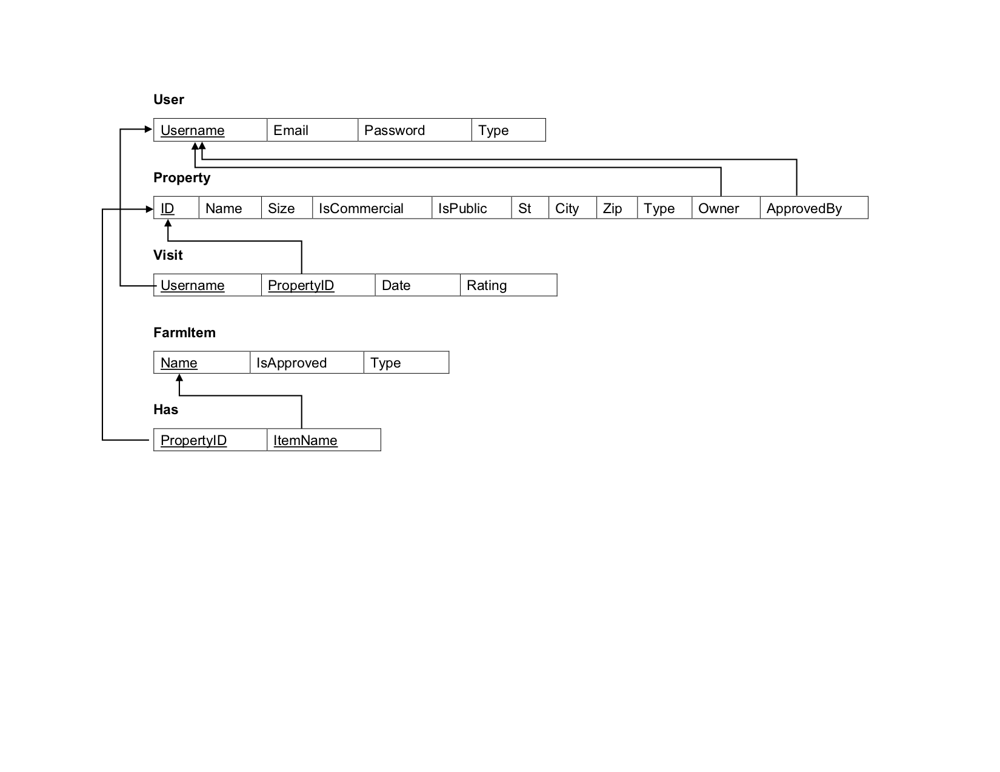

# AGFO-Database_System #
Database application that stores locations, property usage, and ownership information on gardens, farms, and orchards in the Atlanta area.
## Information flow diagram ##

## Enhanced Entity Relationship Diagram ##

## Relational Schema ##

